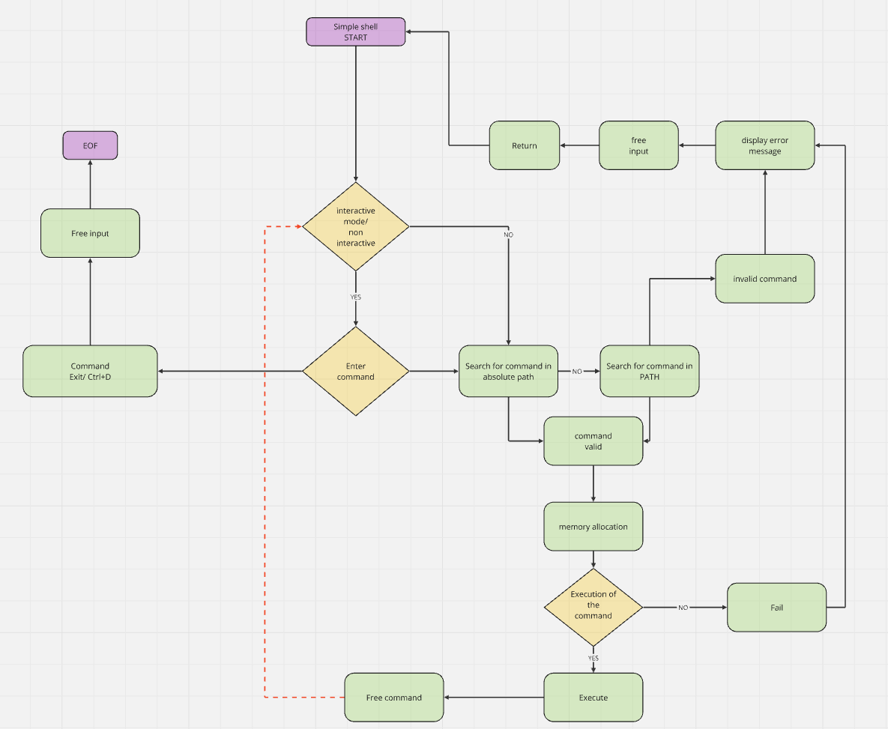

### Description 

This simple shell is a shell interface written in C programming language that displays a *#cisfun$* prompt. This repository contains the files needed to simulate a basic Unix shell with its respective commands similar to those of Ken Thompson's first Shell.

### Environment 

OS : Ubuntu-22.04 

Langage : C

Editor : Visual Studio Code 1.96

Guideline : Betty style

### Prescription

Simple-shell is designed to run in the linux gcc 11.4.0 environment

### Installation compilation and debug 


#### Clone this repository :
https://github.com/Issercio/holbertonschool-simple_shell.git

#### Compilation : 
```
gcc -Wall -Werror -Wextra -pedantic -std=gnu89 *.c -o hsh
```
#### Simple shell execution :
```
./hsh
```
#### Debug :

If you want to analyze errors in your program, you can use valgrind.
```
valgrind --leak-check=full ./hsh
```
### Usage examples:

* echo
```
#cisfun$ echo This is a simple shell 

This is a simple shell
```
* ls

```
#cisfun$ ls
README.md          find_executable.c  handle_error.c  hsh                 path.c       simple_shell.c  str_utils.c  utils.c
execute_command.c  handle_command.c   handle_input.c  man_1_simple_shell  print_env.c  simple_shell.h  test_ls_2 
``` 


* Ctrl+D et Exit
```
#cisfun$ exit

aurelien@DESKTOP-BLAO4BF:~/holbertonschool-simple_shell$
```

### Process Description :

1) First, the program creates a parent process when launched by the user

2) Then it checks if the input comes from a terminal with isatty(). If so, it displays the command prompt and waits for the user to enter a command.

3) When the user types a command, getline() reads the line, then strtok() breaks it into pieces. Then a child process is created with fork() to execute the command. The parent process waits for the child process to finish before continuing.

4) Finally, the command is executed with execve(), the memory is freed with free(), and the command prompt reappears for new input.

### Flowcharts :



#### Files included in the project :

- **find_executable.c :** Searches for an executable in the PATH directories and returns its path if found, otherwise return NULL.

- **handle_error.c :** Displays an error message provided using the perror() function

- **hsh :** Executable file

- **path.c :** searches for an executable file in the PATH directories and returns its full path if found, otherwise NULL.

- **simple_shell.c :** creates an interactive shell that reads and executes the user's commands, handles internal commands like exit and env, and continues until the user exits.

- **str_utils.c :** Implements two functions: _strcmp to compare two strings and _strlen to calculate the length of a string.

- **utils.c :** Implements three functions: _strdup to duplicate a string, _strcpy to copy a string, and _sprintf to format a string with additional arguments.

- **execute_command.c :** Finds the executable of a command, executes it in a child process, handles runtime errors, and waits for it to complete before freeing the memory.

- **handle_command.c :** Processes the user's command, handles internal commands (exit, env), tokenizes the command, searches the PATH for the executable, executes the command in a child process with execve(), displays an error if the command is not found, and waits for the child process to terminate with wait().

- **handle_input.c :** Reads the user's input, processes it by tokenizing it into arguments, checks whether the command is exit, and either executes the command or continues shell execution.

- **man_1_simple_shell :** man page

- **print_env.c :** Loops through and displays all environment variables line by line.

- **simple_shell.h :** Header file defines the function prototypes and includes the libraries needed to implement a simple shell, as well as the declaration of the environ environment variable.

- **test_ls_2 :** contains the absolute path of the ls program

### Manpage:

Access the manpage with man_1_simple_shell

### Authors :

The Simple Shell project was developped by :


[](https://github.com/Aurelien292) ==> All the works


[](https://github.com/Issercio) ==> All the works


